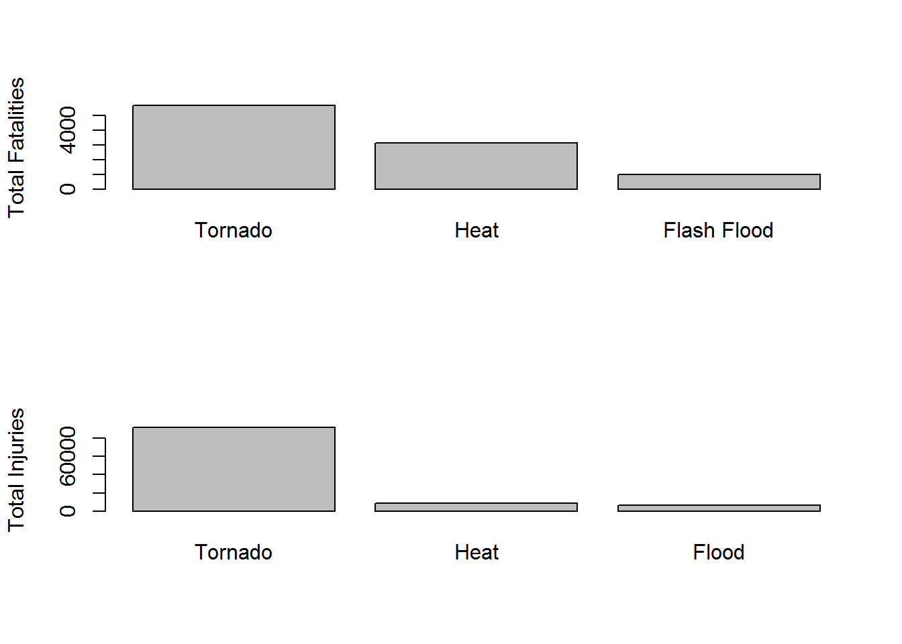

# Health and Economic Consequences of Storms: 1950 - 2011
Charles Brown  
Wednesday, March 18, 2015  

### Synopsis  

This report explores the NOAA Strom Database and shows the types of Events that are most harmful to population health and that cause the most property and crop damage.

### Data Processing  


```r
strUrl <-"https://d396qusza40orc.cloudfront.net/repdata%2Fdata%2FStormData.csv.bz2"
strFilename <-"stormdata.bz2"
strDataDir <-""
```

* If needed, download compressed data [file](https://d396qusza40orc.cloudfront.net/repdata%2Fdata%2FStormData.csv.bz2).


```r
strPathFilename <-file.path(getwd(), strDataDir, strFilename, fsep = "/")
strPathFilename <-sub(pattern = "/{2,}", replacement = "/", x = strPathFilename)
if (!file.exists(strPathFilename))
{
    download.file(url = strUrl, destfile = strPathFilename, mode = "wb")   
}
```

* Read select columns into data frame `df`.


```r
df <-read.csv(file = strPathFilename, stringsAsFactors = FALSE, colClasses = c(rep("NULL",7),"character",rep("NULL",14),rep("numeric",3),"character","numeric","character",rep("NULL",9)))
summary(df)
```

```
##     EVTYPE            FATALITIES          INJURIES        
##  Length:902297      Min.   :  0.0000   Min.   :   0.0000  
##  Class :character   1st Qu.:  0.0000   1st Qu.:   0.0000  
##  Mode  :character   Median :  0.0000   Median :   0.0000  
##                     Mean   :  0.0168   Mean   :   0.1557  
##                     3rd Qu.:  0.0000   3rd Qu.:   0.0000  
##                     Max.   :583.0000   Max.   :1700.0000  
##     PROPDMG         PROPDMGEXP           CROPDMG         CROPDMGEXP       
##  Min.   :   0.00   Length:902297      Min.   :  0.000   Length:902297     
##  1st Qu.:   0.00   Class :character   1st Qu.:  0.000   Class :character  
##  Median :   0.00   Mode  :character   Median :  0.000   Mode  :character  
##  Mean   :  12.06                      Mean   :  1.527                     
##  3rd Qu.:   0.50                      3rd Qu.:  0.000                     
##  Max.   :5000.00                      Max.   :990.000
```

* #### Calculate A New Event Group Variable `(df$EVTGROUP)` to summarize the 985 event types.  
 

```r
df$EVTGROUP <-NA
#
df[grep("^astro|^blow-out tide|^high tides",df$EVTYPE, ignore.case = TRUE),"EVTGROUP"] <-"Tides"
df[grep("^aval",df$EVTYPE, ignore.case = TRUE),"EVTGROUP"] <-"Avalanche"
df[grep("^blizz",df$EVTYPE, ignore.case = TRUE),"EVTGROUP"] <-"Blizzard"
df[grep("^coastal flood",df$EVTYPE, ignore.case = TRUE),"EVTGROUP"] <-"Coastal Flood"
df[grep("wind chill",df$EVTYPE, ignore.case = TRUE),"EVTGROUP"] <-"Wind Chill"
df[grep("debris flow",df$EVTYPE, ignore.case = TRUE),"EVTGROUP"] <-"Debris Flow"
df[grep("dense fog",df$EVTYPE, ignore.case = TRUE),"EVTGROUP"] <-"Dense Fog"
df[grep("smoke",df$EVTYPE, ignore.case = TRUE),"EVTGROUP"] <-"Dense Smoke"
df[grep("drought",df$EVTYPE, ignore.case = TRUE),"EVTGROUP"] <-"Drought"
df[grep("dust devil",df$EVTYPE, ignore.case = TRUE),"EVTGROUP"] <-"Dust Devil"
df[grep("^dust storm",df$EVTYPE, ignore.case = TRUE),"EVTGROUP"] <-"Dust Storm"
df[grep("^excessive heat|record/excessive heat",df$EVTYPE, ignore.case = TRUE),"EVTGROUP"] <-"Excessive Heat"
df[grep("extreme cold",df$EVTYPE, ignore.case = TRUE),"EVTGROUP"] <-"Extreme Cold/Wind Chill"
df[grep("^flood|flooding$",df$EVTYPE, ignore.case = TRUE),"EVTGROUP"] <-"Flood"
df[grep("^flash flood",df$EVTYPE, ignore.case = TRUE),"EVTGROUP"] <-"Flash Flood"
df[grep("frost",df$EVTYPE, ignore.case = TRUE),"EVTGROUP"] <-"Forst/Freeze"
df[grep("funnel",df$EVTYPE, ignore.case = TRUE),"EVTGROUP"] <-"Funnel Cloud"
df[grep("freezing fog",df$EVTYPE, ignore.case = TRUE),"EVTGROUP"] <-"Freezing Fog"
df[grep("hail",df$EVTYPE, ignore.case = TRUE),"EVTGROUP"] <-"Hail"
df[grep("^excessive heat|^extreme heat|^record heat|^heat|excessive heat$",df$EVTYPE, ignore.case = TRUE),"EVTGROUP"] <-"Heat"
df[grep("^heavy rain",df$EVTYPE, ignore.case = TRUE),"EVTGROUP"] <-"Heavy Rain"
df[grep("^heavy snow|snow and heavy snow|snow/heavy snow",df$EVTYPE, ignore.case = TRUE),"EVTGROUP"] <-"Heavy Snow"
df[grep("^high surf",df$EVTYPE, ignore.case = TRUE),"EVTGROUP"] <-"High Surf"
df[grep("^high wind",df$EVTYPE, ignore.case = TRUE),"EVTGROUP"] <-"High Wind"
df[grep("^hurricane|^typhoon",df$EVTYPE, ignore.case = TRUE),"EVTGROUP"] <-"Hurricane Typhoon"
df[grep("^ice storm|glaze/ice storm|sleet/ice storm|snow and ice storm|snow/ice storm",df$EVTYPE, ignore.case = TRUE),"EVTGROUP"] <-"Ice Storm"
df[grep("lake-effect snow",df$EVTYPE, ignore.case = TRUE),"EVTGROUP"] <-"Lake-Effect Snow"
df[grep("lakeshore flood",df$EVTYPE, ignore.case = TRUE),"EVTGROUP"] <-"Lakeshore Flood"
df[grep("^lightning",df$EVTYPE, ignore.case = TRUE),"EVTGROUP"] <-"Lightning"
df[grep("marine hail",df$EVTYPE, ignore.case = TRUE),"EVTGROUP"] <-"Marine Hail"
df[grep("marine high wind",df$EVTYPE, ignore.case = TRUE),"EVTGROUP"] <-"Marine High Wind"
df[grep("marine strong wind",df$EVTYPE, ignore.case = TRUE),"EVTGROUP"] <-"Marine Strong Wind"
df[grep("marine thunderstorm wind",df$EVTYPE, ignore.case = TRUE),"EVTGROUP"] <-"Marine Thunderstorm Wind"
df[grep("rip current",df$EVTYPE, ignore.case = TRUE),"EVTGROUP"] <-"Rip Current"
df[grep("seiche",df$EVTYPE, ignore.case = TRUE),"EVTGROUP"] <-"Seiche"
df[grep("sleet|^freezing drizzle|^freezing rain",df$EVTYPE, ignore.case = TRUE),"EVTGROUP"] <-"Sleet"
df[grep("storm surge",df$EVTYPE, ignore.case = TRUE),"EVTGROUP"] <-"Storm Surge"
df[grep("^strong wind",df$EVTYPE, ignore.case = TRUE),"EVTGROUP"] <-"Strong Wind"
df[grep("gusty thunderstorm wind|^severe thunderstorm wind|^thunderstorm wind",df$EVTYPE, ignore.case = TRUE),"EVTGROUP"] <-"Thunderstorm Wind"
df[grep("tornado",df$EVTYPE, ignore.case = TRUE),"EVTGROUP"] <-"Tornado"
df[grep("tropical depression",df$EVTYPE, ignore.case = TRUE),"EVTGROUP"] <-"Tropical Depression"
df[grep("tropical storm",df$EVTYPE, ignore.case = TRUE),"EVTGROUP"] <-"Tropical Storm"
df[grep("tsunami",df$EVTYPE, ignore.case = TRUE),"EVTGROUP"] <-"Tsunami"
df[grep("volcanic",df$EVTYPE, ignore.case = TRUE),"EVTGROUP"] <-"Volcanic Ash"
df[grep("^waterspout",df$EVTYPE, ignore.case = TRUE),"EVTGROUP"] <-"Waterspout"
df[grep("wildfire",df$EVTYPE, ignore.case = TRUE),"EVTGROUP"] <-"Wildfire"
df[grep("^winter storm",df$EVTYPE, ignore.case = TRUE),"EVTGROUP"] <-"WinterStorm"
df[grep("winter weather",df$EVTYPE, ignore.case = TRUE),"EVTGROUP"] <-"Winter Weather"
```

* #### Calculate New Damage Amount Variables `(df$PROPDMGAMT & df$CROPDMGAMT)` for each event type.


```r
df$PROPDMGAMT <-NA
#
df[grep("[0-9]",df$PROPDMGEXP),"PROPDMGAMT"] <-(10^as.numeric(df[grep("[0-9]",df$PROPDMGEXP,),"PROPDMGEXP"])) * df[grep("[0-9]",df$PROPDMGEXP,),"PROPDMG"] 
df[grep("B",df$PROPDMGEXP, ignore.case = TRUE),"PROPDMGAMT"] <-df[grep("B",df$PROPDMGEXP, ignore.case = TRUE),"PROPDMG"] * 1000000000 
df[grep("M",df$PROPDMGEXP, ignore.case = TRUE),"PROPDMGAMT"] <-df[grep("M",df$PROPDMGEXP, ignore.case = TRUE),"PROPDMG"] * 1000000
df[grep("K",df$PROPDMGEXP, ignore.case = TRUE),"PROPDMGAMT"] <-df[grep("K",df$PROPDMGEXP, ignore.case = TRUE),"PROPDMG"] * 1000
df[grep("H",df$PROPDMGEXP, ignore.case = TRUE),"PROPDMGAMT"] <-df[grep("H",df$PROPDMGEXP, ignore.case = TRUE),"PROPDMG"] * 100
#
df$CROPDMGAMT <-NA
#
df[grep("[0-9]",df$CROPDMGEXP),"CROPDMGAMT"] <-(10^as.numeric(df[grep("[0-9]",df$CROPDMGEXP,),"CROPDMGEXP"])) * df[grep("[0-9]",df$CROPDMGEXP,),"CROPDMG"] 
df[grep("B",df$CROPDMGEXP, ignore.case = TRUE),"CROPDMGAMT"] <-df[grep("B",df$CROPDMGEXP, ignore.case = TRUE),"CROPDMG"] * 1000000000 
df[grep("M",df$CROPDMGEXP, ignore.case = TRUE),"CROPDMGAMT"] <-df[grep("M",df$CROPDMGEXP, ignore.case = TRUE),"CROPDMG"] * 1000000
df[grep("K",df$CROPDMGEXP, ignore.case = TRUE),"CROPDMGAMT"] <-df[grep("K",df$CROPDMGEXP, ignore.case = TRUE),"CROPDMG"] * 1000
df[grep("H",df$CROPDMGEXP, ignore.case = TRUE),"CROPDMGAMT"] <-df[grep("H",df$CROPDMGEXP, ignore.case = TRUE),"CROPDMG"] * 100
```

* #### Calculate New Total Vectors for Fatalities, Injuries, Property Damage and Crop Damage by Event Group `(df$EVTGROUP)`.


```r
Fatalities <-tapply(X = df$FATALITIES, INDEX = df$EVTGROUP, FUN = sum, na.rm = TRUE)
Injuries <-tapply(X = df$INJURIES, INDEX = df$EVTGROUP, FUN = sum, na.rm = TRUE)
PropDmgAmt <-tapply(X = df$PROPDMGAMT, INDEX = df$EVTGROUP, FUN = sum, na.rm = TRUE)
CropDmgAmt <-tapply(X = df$CROPDMGAMT, INDEX = df$EVTGROUP, FUN = sum, na.rm = TRUE)
```

### Results 

* #### Ranking of Event Groups by Population Fatalities.


```r
(Fatalities <-sort(x = Fatalities, decreasing = TRUE))
```

```
##                  Tornado                     Heat              Flash Flood 
##                     5658                     3138                     1018 
##                Lightning              Rip Current                    Flood 
##                      817                      577                      501 
##                High Wind  Extreme Cold/Wind Chill                Avalanche 
##                      293                      287                      225 
##              WinterStorm        Thunderstorm Wind        Hurricane Typhoon 
##                      217                      199                      135 
##               Heavy Snow              Strong Wind                High Surf 
##                      129                      111                      104 
##                 Blizzard               Heavy Rain               Wind Chill 
##                      101                       98                       95 
##                Ice Storm                 Wildfire           Tropical Storm 
##                       89                       75                       66 
##           Winter Weather                  Tsunami              Storm Surge 
##                       61                       33                       24 
##               Dust Storm                     Hail                Dense Fog 
##                       22                       20                       18 
##       Marine Strong Wind                    Sleet Marine Thunderstorm Wind 
##                       14                       12                       10 
##               Waterspout            Coastal Flood               Dust Devil 
##                        6                        3                        2 
##             Forst/Freeze         Marine High Wind              Dense Smoke 
##                        1                        1                        0 
##                  Drought             Freezing Fog             Funnel Cloud 
##                        0                        0                        0 
##         Lake-Effect Snow          Lakeshore Flood              Marine Hail 
##                        0                        0                        0 
##                   Seiche                    Tides      Tropical Depression 
##                        0                        0                        0 
##             Volcanic Ash 
##                        0
```

* #### Ranking of Event Groups by Population Injuries. 


```r
(Injuries <-sort(x = Injuries, decreasing = TRUE))
```

```
##                  Tornado                     Heat                    Flood 
##                    91364                     9224                     6808 
##                Lightning        Thunderstorm Wind                Ice Storm 
##                     5232                     2402                     1992 
##              Flash Flood                High Wind                     Hail 
##                     1785                     1471                     1466 
##              WinterStorm        Hurricane Typhoon               Heavy Snow 
##                     1353                     1333                     1034 
##                 Wildfire                 Blizzard           Winter Weather 
##                      911                      805                      538 
##              Rip Current               Dust Storm           Tropical Storm 
##                      529                      440                      383 
##                Dense Fog              Strong Wind  Extreme Cold/Wind Chill 
##                      342                      301                      255 
##               Heavy Rain                Avalanche                High Surf 
##                      255                      170                      156 
##                  Tsunami               Waterspout               Dust Devil 
##                      129                       72                       43 
##              Storm Surge                    Sleet Marine Thunderstorm Wind 
##                       43                       38                       26 
##       Marine Strong Wind               Wind Chill            Coastal Flood 
##                       22                       12                        7 
##                  Drought             Forst/Freeze             Funnel Cloud 
##                        4                        3                        3 
##         Marine High Wind              Dense Smoke             Freezing Fog 
##                        1                        0                        0 
##         Lake-Effect Snow          Lakeshore Flood              Marine Hail 
##                        0                        0                        0 
##                   Seiche                    Tides      Tropical Depression 
##                        0                        0                        0 
##             Volcanic Ash 
##                        0
```

* #### Plot Ranking of Event Groups by Fatalities and Injuries. 


```r
par(mfrow = c(2,1))
barplot(Fatalities[1:5], ylab = "Total Fatalities")
barplot(Injuries[1:5], ylab = "Total Injuries")
```

 

```r
par(mfrow = c(1,1))
```

* #### Ranking of Event Groups by Property & Crop Damage.   


```r
(PropDmgAmt <-sort(x = PropDmgAmt, decreasing = TRUE))
```

```
##                    Flood        Hurricane Typhoon                  Tornado 
##             145223640907              85356410010              58552151864 
##              Storm Surge              Flash Flood                     Hail 
##              47964724000              17414680872              16021900956 
##           Tropical Storm              WinterStorm                High Wind 
##               7714390550               6748997251               6003352990 
##        Thunderstorm Wind                 Wildfire                Ice Storm 
##               5431305978               4865614000               3945527860 
##               Heavy Rain                  Drought               Heavy Snow 
##               3230998140               1046106000                953697140 
##                Lightning                 Blizzard            Coastal Flood 
##                935452427                659713950                279600560 
##              Strong Wind                  Tsunami                High Surf 
##                177674240                144062000                 89955000 
##  Extreme Cold/Wind Chill               Waterspout         Lake-Effect Snow 
##                 76385400                 60730200                 40115000 
##           Winter Weather                     Heat             Forst/Freeze 
##                 27298000                 20325750                 10995000 
##                    Sleet                    Tides                Dense Fog 
##                 10366500                  9745150                  9674000 
##          Lakeshore Flood               Dust Storm                Avalanche 
##                  7540000                  5599000                  3721800 
##             Freezing Fog               Wind Chill      Tropical Depression 
##                  2182000                  2040000                  1737000 
##         Marine High Wind                   Seiche               Dust Devil 
##                  1297010                   980000                   719130 
##             Volcanic Ash Marine Thunderstorm Wind       Marine Strong Wind 
##                   500000                   436400                   418330 
##             Funnel Cloud              Rip Current              Dense Smoke 
##                   194600                   163000                   100000 
##              Marine Hail 
##                     4000
```

```r
(CropDmgAmt <-sort(x = CropDmgAmt, decreasing = TRUE))
```

```
##                  Drought                    Flood        Hurricane Typhoon 
##              13972566000               5912155450               5516117800 
##                Ice Storm                     Hail              Flash Flood 
##               5022113500               3111633870               1437163150 
##  Extreme Cold/Wind Chill             Forst/Freeze                     Heat 
##               1313023000               1202186000                904469280 
##               Heavy Rain           Tropical Storm                High Wind 
##                795752800                694896000                686301900 
##        Thunderstorm Wind                  Tornado                 Wildfire 
##                634694380                417461520                295972800 
##               Heavy Snow                 Blizzard              Strong Wind 
##                134673100                112060000                 69953500 
##              WinterStorm           Winter Weather                Lightning 
##                 32444000                 15000000                 12092090 
##               Dust Storm              Storm Surge               Wind Chill 
##                  3600000                   855000                   600000 
## Marine Thunderstorm Wind                  Tsunami                Avalanche 
##                    50000                    20000                        0 
##            Coastal Flood                Dense Fog              Dense Smoke 
##                        0                        0                        0 
##               Dust Devil             Freezing Fog             Funnel Cloud 
##                        0                        0                        0 
##                High Surf         Lake-Effect Snow          Lakeshore Flood 
##                        0                        0                        0 
##              Marine Hail         Marine High Wind       Marine Strong Wind 
##                        0                        0                        0 
##              Rip Current                   Seiche                    Sleet 
##                        0                        0                        0 
##                    Tides      Tropical Depression             Volcanic Ash 
##                        0                        0                        0 
##               Waterspout 
##                        0
```

* #### Plot Ranking of Event Groups by Property & Crop Damage. 


```r
barplot(PropDmgAmt[1:5]/1000000000, ylab = "Total Property Damage - $Billons")
```

 

```r
barplot(CropDmgAmt[1:5]/1000000000, ylab = "Total Crop Damage - $Billions")
```

 


